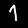
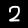
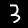
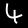
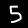
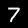
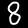
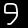

# Digit-Classifier
### By Arda Mavi

Handwritten digit classifier with deep learning. 
Trained on MNIST

### Example:
||||||
|:-:|:-:|:-:|:-:|:-:|
|Predict: 0|Predict: 1|Predict: 2|Predict: 3|Predict: 4|
||||||
|Predict: 5|Predict: 6|Predict: 7|Predict: 8|Predict: 9|

##### In this example datasets, all predict correct.
##### Details of this example:
- Epochs = 2
- Batch Size = 100
- Used data per epoch: 10000

### Using Predict Command:
`python3 predict.py <ImageFileName>`

### Model Training:
`python3 train.py`

### Using TensorBoard:
`tensorboard --logdir=Data/Checkpoints/logs`

### Model Architecture:
- Input Data
Shape: 28x28x1

- Max Pooling
Pool shape: 2x2
Strides: 2x2

- Convolutional Layer
64 filter
Filter shape: 3x3
Strides: 1x1

- Activation
Function: ReLu

- Convolutional Layer
64 filter
Filter shape: 3x3
Strides: 1x1

- Activation
Function: ReLu

- Max Pooling
Pool shape: 2x2
Strides: 2x2

- Flatten

- Dense
Size: 128

- Activation
Function: ReLu

- Dropout
Rate: 0.5

- Dense
Size: 10

- Activation
Function: Sigmoid

##### Optimizer: Adadelta
##### Loss: Categorical Crossentropy

### Important Notes:
- Used Python Version: 3.6.0

- Install necessary modules with `sudo pip3 install -r requirements.txt` command.

- Used Keras for making deep learning model. Keras is a simple and strong deep learning library, written in Python and running with TensorFlow and Theano.

- Used TensorFlow background in Keras because Tensorflow has better multiple GPUs support than Theano.

- We work on 28x28 image also if you use bigger or smaller, program will automatically return to 28x28.
